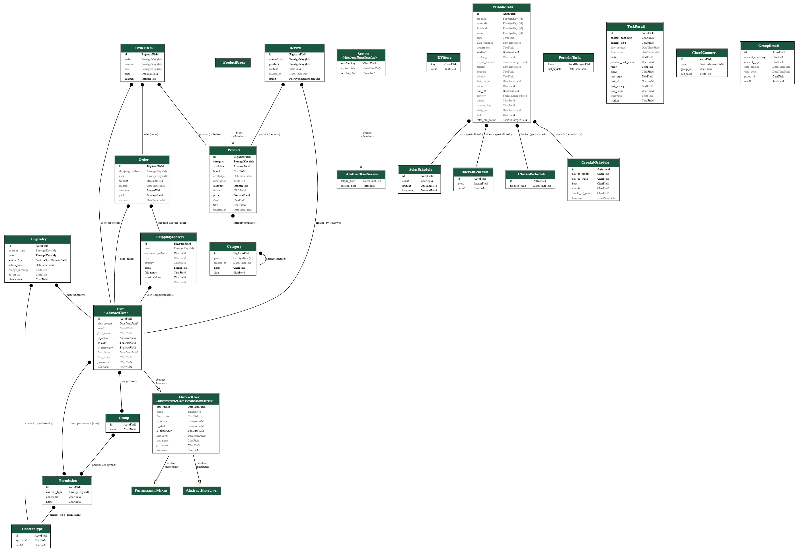
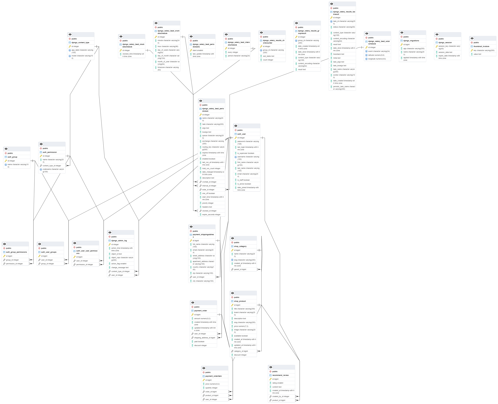

# eShopExpress

eShopExpress is a modern online store that provides users with a convenient and secure way to shop, order products and make online payments. The entire process is displayed in an intuitive interface that provides a positive and efficient shopping experience.

The project is designed to be at the forefront of e-commerce technology, providing a robust and flexible system for managing items, shopping cart, and secure payment interactions. Each step of the shopping experience is intuitive and maximizes user-friendliness.

eShopExpress is committed to providing customers with a complete electronic interaction, creating a platform where shopping becomes an enjoyable and efficient process.

## Detailed project description

### List of applications

```py
# Apps
'shop.apps.ShopConfig',
'cart.apps.CartConfig',
'account.apps.AccountConfig',
'payment.apps.PaymentConfig',
'recommend.apps.RecommendConfig',
```

The eShopExpress project is organized using a modular structure divided into several applications for easy management and functionality expansion. Each application performs specific tasks, ensuring efficient interaction between different components of the system. Here is a brief description of each application:

1. **ShopConfig**:
    - The main application of the store, responsible for displaying the product catalog.
    - Managing information about products, their categories and characteristics.
    - Implementation of product search and filtering functions.

2. **CartConfig**:
    - A shopping cart application that provides users with a convenient mechanism for managing items in the cart.
    - Implementation of operations of adding, deleting and changing the number of items in the cart.

3. **AccountConfig**:
    - An application responsible for managing user accounts.
    - Registration, login and password recovery are available.

4. **PaymentConfig**:
    - Application for payment processing.
    - Integration with Stripe payment system or other payment mechanisms.
    - Track transaction statuses and process payment notifications.

5. **RecommendConfig**:
    - Implementation of a system of recommendations for users.
    - Analyzing customer preferences and offering personalized recommendations.

Each application within a project has clearly defined functions, providing ease of support, scalability, and development. The modular structure allows developers to focus on specific aspects of functionality, increasing project flexibility.

### Main libraries

```py
# Libraries
'mathfilters',
'crispy_forms',
'crispy_bootstrap5',
'django_email_verification',
'django_google_fonts',
'sorl.thumbnail',
'django_celery_beat',
'django_celery_results',
'django_htmx',
'rest_framework',
'djoser',
'drf_yasg',
'django_extensions',
```

The eShopExpress project implements a variety of libraries that facilitate development, add functionality, and improve visual design. Here is a detailed description of each of the libraries used:

1. **mathfilters**:
    - Math filters for use in Django templates.
    - Provides convenient math operations in templates, such as rounding, modulus calculation, etc.

2. **crispy_forms** and **crispy_bootstrap5**:
    - Libraries for styling forms in Django.
    - Allow easy customization and styling of forms, providing a more attractive appearance.

3. **django_email_verification**:
    - A module for validating users' email addresses.
    - Enhances security and validation of legitimacy of email addresses during user registration.

4. **sorl.thumbnail**:
    - Django's image processing library.
    - Provides convenient tools for resizing images, creating thumbnails, and other manipulations.

5. **django_celery_beat** and **django_celery_results**:
    - Tools for handling asynchronous tasks in Django.
    - Allow you to schedule and execute asynchronous tasks, such as sending notifications or handling long-running operations.

6. **django_htmx**:
    - A library for providing dynamic client-side interaction.
    - Allows page content to be updated without reloading, improving the user experience.

7. **rest_framework**, **djoser** and **drf_yasg**:
    - Frameworks for creating RESTful APIs in Django.
    - Provide easy API creation and documentation, and add additional functionality such as authentication and authorization.

8. **django_extensions**:
    - Django extension with useful development tools.
    - Includes various management commands, debugging tools, and other enhancements to simplify development.

These libraries are an integral part of the project, providing developers with powerful tools to create efficient and attractive web applications.

### Actual console commands

For the convenience of developers, the project provides various console commands that provide management and monitoring of various aspects of the application. These commands provide convenient tools for developers to manage various aspects of the application, providing flexibility and efficiency in the development and maintenance process. A detailed description and usage of each command is provided in the [Console commands](commands.md) file.

### Fake Product Generator

The `eshopexpress/shop/management/commands/` directory contains two scripts for generating fake product data for the Django project. It is recommended to read the more detailed documentation provided in the file [Fake Product Generator README](eshopexpress/shop/management/commands/README.md).

It is recommended to use these scripts when you need to fill the database with test or demo data. Their use can greatly simplify the process of developing and testing the store functionality.

### Installing libraries

To ensure correct operation of the eShopExpress application, it is recommended to install the required libraries listed in the [Requirements.txt](requirements.txt) file. This file contains a list of all project dependencies.

These commands will ensure that the required libraries are installed in the project's virtual environment, ensuring that all dependencies are satisfied and the application will run correctly. Make sure that the virtual environment is enabled before performing the installation.

### Using the virtual environment

It is recommended to use a virtual environment to isolate the project and its dependencies.

### Tool Configuration

The `flake8` and `autopep8` tools are configured in the eShopExpress project using the [setup.cfg](setup.cfg) file.

This file allows you to maintain coding standards, provides uniformity in the code, and simplifies the process of working with the project using code validation and formatting tools.

### Administrative Data

To easily manage the Django administrative panels and Django REST framework in the eShopExpress project, an [admin.txt](admin.txt) file containing credentials such as logins, passwords, and email addresses is provided.

These credentials provide access to administrative panels as well as a token to access the API.

### Payment via Stripe

In the eShopExpress project the possibility of payment using Stripe technology is implemented. The application [stripe.exe](eshopexpress/stripe/stripe.exe) for Windows platform is provided to manage payments. Detailed version information and download link can be found in the file [version.txt](eshopexpress/stripe/version.txt).

Utilizing Stripe technology provides a secure and convenient means to process online payments in the application. Ensure that the [stripe.exe](eshopexpress/stripe/stripe.exe) application is up to date with the latest version.

### Using GOOGLE FONTS

The eShopExpress project uses fonts from Google Fonts, which are stored in the [static/fonts/](eshopexpress/static/fonts/) directory. This ensures that text on the application's web pages is displayed in a stylish and professional manner.

Using Google Fonts provides the ability to choose from a variety of fonts suitable for different styles and designs. This is an additional element that contributes to creating an attractive and professional appearance of the application.

### Redis

In the eShopExpress project, the Redis client for Windows is used to work with data. This client is located in the directory [redis-x64-3.0.504](eshopexpress/redis-x64-3.0.504).

Using Redis in the project is an important part of optimizing data handling and providing quick access to key information.

## List of technologies used

| Technology/Tool | Description |
|------------------------|----------------------------------------|
| Python | The programming language, the core of the project |
| Django | A web framework for developing web applications |
| Django REST framework | A framework for creating RESTful APIs |
| HTML | HTML | A markup language for web pages |
| HTMX | Library for dynamically modifying HTML using AJAX |
| CSS | CSS | Cascading Style Sheets for designing web pages |
| JS | JavaScript client-side programming language |
| Celery | Asynchronous task queue for handling background tasks |
| Redis | A database management system used for caching data |
| PostgreSQL | A relational database management system |
| Google Fonts | A collection of free fonts used to stylize text |
| Stripe | A payment service for processing online payments |
| WeasyPrint | HTML to PDF conversion tool |
| GTK3 | A tool for creating graphical interfaces |

These technologies and tools provide a variety of functionality in the eShopExpress project, including interface development, payment processing, database management, and more.

## Site functionality, its purpose

eShopExpress provides versatile functionality, making online shopping convenient and enjoyable for users. Here are the main features of the site:

- **Product Browsing**
Users can easily browse through a variety of products in the store. It is possible to filter products by various criteria, which simplifies the process of searching for the desired product.

- **Cart and order placement**
The shopping cart system provides a convenient mechanism for managing products added to the cart. Users can easily change the quantity of items and proceed to checkout with minimal effort.

- **Payment via Stripe**
To provide secure and convenient payment, eShopExpress utilizes Stripe technology. This ensures that online transactions are secure and payment security standards are met.

- **Fake Product Generation**.
Developers can take advantage of the ability to generate test product data using special scripts (`fakeproducts.py` and `fakestoreapi.py`). This is convenient for testing and creating demo data.

- **Administrative panels**
Convenient Django administrative panels are available for managing application data. This allows administrators to efficiently manage items, orders, and other aspects of the application.

- **Console Commands**
Various console commands provide convenient means of managing the application directly from the command line. For example, you can easily migrate the database, start the development server, and manage Celery tasks.

- **PostgreSQL database**
The eShopExpress project relies on PostgreSQL database for efficient data storage and management. PostgreSQL provides reliability and performance to handle information about products, orders, and other important aspects of the application.

## Preview of the site appearance

The presented image demonstrates the appearance of the eShopExpress website. The visual interface is thoughtful, modern and attractive to users. This preview provides an overview of the page design, color palette and overall interface composition, which contributes to a positive user experience.


## Preview graph models

- Django graph models



This image shows graphical models representing the relationships and data structure in the eShopExpress project using Django. Graphical representation of models helps to better understand the relationships between different elements of the application such as products, orders, users and other key aspects.

- PostgreSQL graph models



This is a graphical representation of the PostgreSQL database models used in the project. The tables and the relationships between them are illustrated here, which helps to understand the database structure and data organization within the application. This is a useful tool for developers and database administrators when working with the eShopExpress project.
